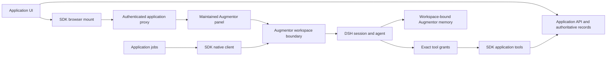

<!-- Copyright © 2026 Manolo Remiddi · SPDX-License-Identifier: LicenseRef-Augmentor-MIT-Resale-1.0 -->
# Feasibility and readiness

This guide describes the released DSH/Linux baseline. The unreleased preview 4
[alignment candidate](RUNTIME-ALIGNMENT.md) adds feature negotiation, experimental
Codex and OS discovery/startup adapters with separate platform and customer gates.

The design is feasible for an owner installing trusted applications on a Linux
host running Augmentor and DSH. The two existing integrations already share the
necessary boundaries: an application API and data store, an Augmentor workspace
identity, direct DSH tools, workspace memory, and the maintained Browser panel.
The preview formalizes those boundaries and extracts the duplicated glue.

The SDK does not become a second agent loop. App records and saved artifacts
remain authoritative; conversation completion and derived memory are not proof
that business work succeeded. A host application can be reached through a private
NAS tunnel while the model host remains local.

## Fortification delivered

| Earlier integration risk | Preview contract |
| --- | --- |
| App copies of native transport and UI wrapper | Shared package; product-owned UI and native host |
| Implicit runtime assumptions | Versioned manifest and `augmentor-app/1` negotiation |
| Specialist role inherits broad tools | Exact grants in the assembled model catalog and a monotonic DSH execution guard |
| Shared settings reachable from app | Runtime administration denied at the workspace boundary |
| Session or memory identity changes during migration | Stable preset/cwd/memory identity, collision checks |
| Partial preset/profile installation | Lock, journal, before-images and crash recovery |
| Timeout interpreted as safe retry | Explicit unknown outcomes and no transport replay |
| Background completion races | Optional leases, attempt fencing and app-owned output validation |
| Browser credentials reaching the runtime | Server-held token; Host/Origin/owner checks on HTTP and sockets |
| Voice treated as mandatory | Experimental, off by default, workspace toggle |

The existing app migrations deliberately keep their domain databases and job
validation. SDK receipt and lease helpers are available to new applications;
their tests do not prove every existing backend implements the same guarantees.

## Gates before a broader release

1. The owner independently builds the third application without this agent's
   involvement. That is the adoption test; fixtures and these two migrations
   do not establish third-party usability.
2. The two existing apps are deployed and their real model/tool/browser routes
   qualified on Linux. Preserve the recorded rollback procedure for further updates.
3. Exercise representative real tasks, cancellation, sleep/reconnect and unknown
   outcomes in each adopted application, including its own OAuth and data rules.
4. Qualify additional operating systems and distribution methods before claiming
   support. The preview currently relies on a compatible managed Linux runtime.
5. Before multi-user or untrusted-plugin hosting, add process isolation, distinct
   credentials/identities, quotas and audit/retention policies. This design grants
   trusted installed JavaScript the host process's OS access.

Resonant Voice remains optional and experimental. A later voice-provider contract
should assess OpenAI cloud voice alongside alternatives: authentication, cost,
audio transport, cancellation, privacy and failure behavior. No provider-specific
cloud implementation or qualification is included now. Pi and Codex are deferred.

The source is ready for a developer preview. General availability remains gated
by the independent adoption and deployment evidence above. See
[exact qualification and rollout status](QUALIFICATION.md).

Preview 3 improves agent adoption with a self-contained [entry guide](AGENT-INTEGRATION.md),
tested packaged scaffold, complete API/acceptance/troubleshooting guides,
non-executing file validation and read-only registration planning. A clean-consumer
fixture checks the shipped package in CI. This reduces undocumented integration
work; it does not establish the independent third-app result or qualify a fresh
managed-runtime installer. That runtime remains a required prerequisite.
